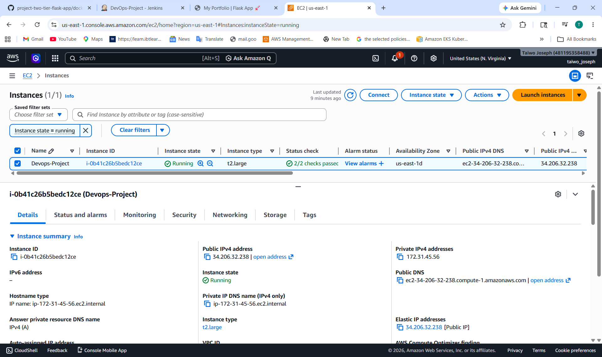
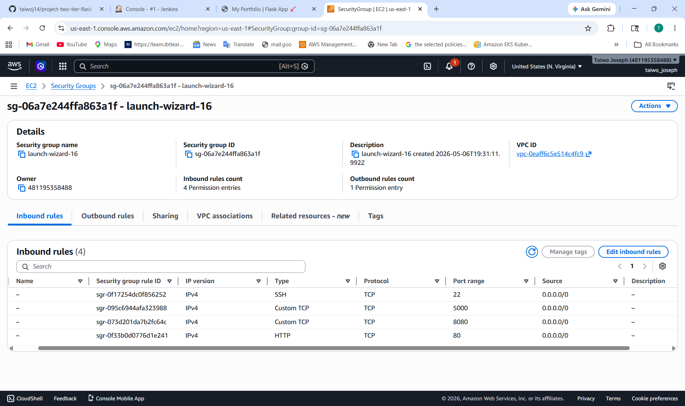
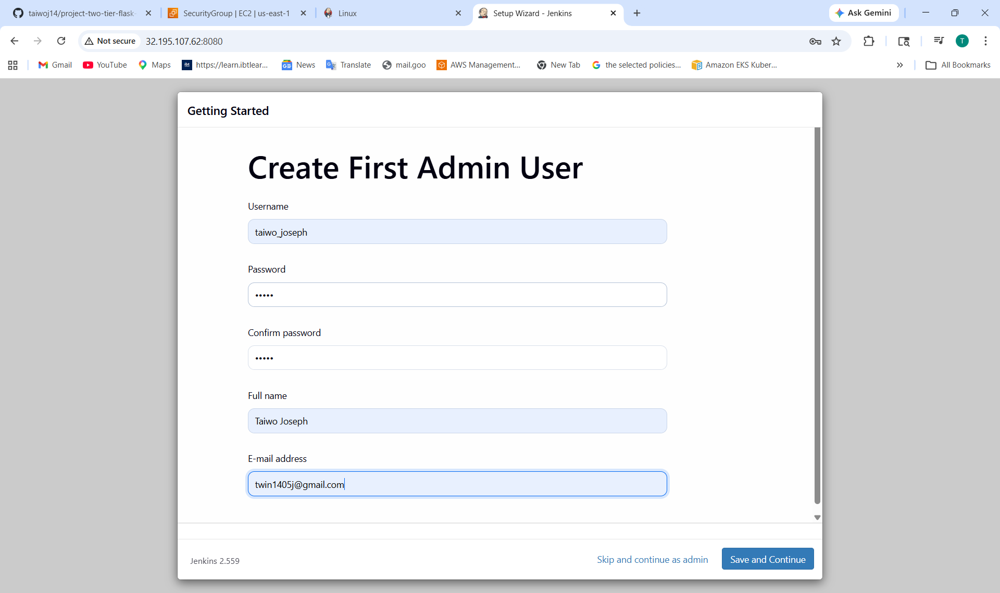
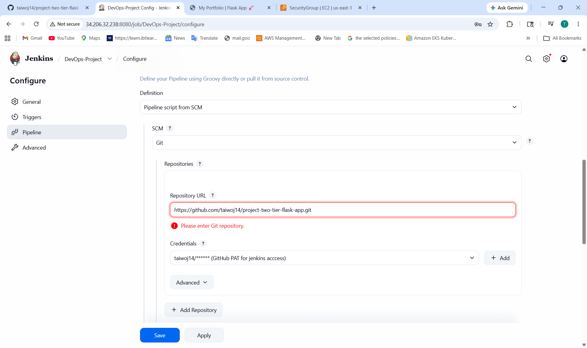
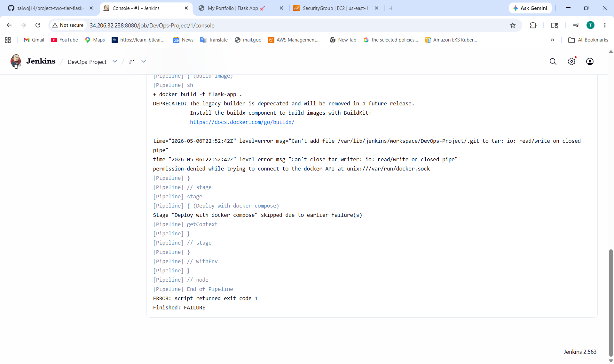
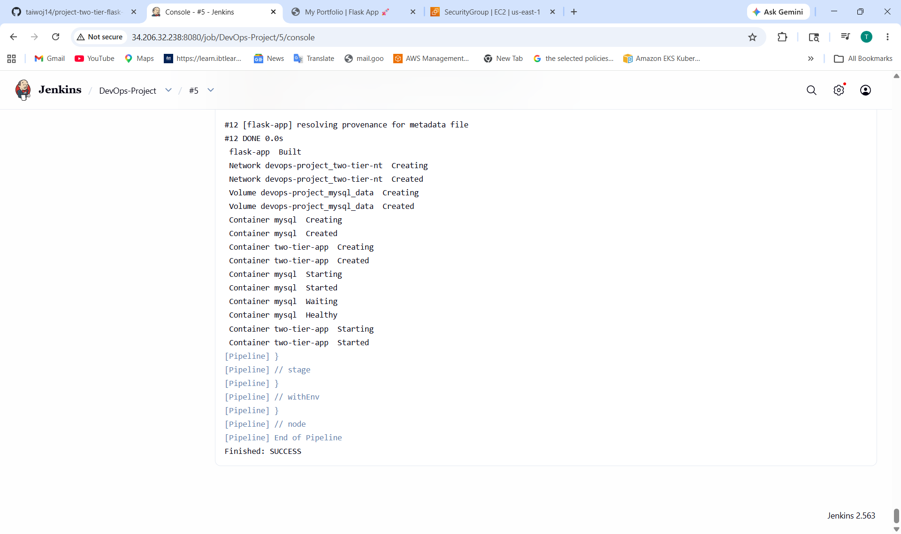

# DevOps Project Report: Automated CI/CD Pipeline for a 2-Tier Flask Application on AWS

**Author:** Taiwo Joseph
**Date:** May 07, 2026
---
### **1. Project Overview**
This project involves the development of an automated CI/CD pipeline for two-tier Flask application deployed on AWS. The application consists of a Flask frontend and MySQL backend, containerized using Docker and managed with Docker Compose. Jenkins was used to automate the build and deployment process, while Github served as the version control platform. The project demonstrates key DevOps practices such as continous integration, continous deployment,containerization, and cloud-based application deployment.
---
### **2. Step 1: AWS EC2 Instance Preparation**

1.  **Launch EC2 Instance:**
    * Navigate to the AWS EC2 console.
    * Launch a new instance using the **Ubuntu 26.04 LTS** AMI.
    * Select the **t2.large** instance type 
    * Create and assign a new key pair for SSH access.



2.  **Configure Security Group:**
    * Create a security group with the following inbound rules:
        * **Type:** SSH, **Protocol:** TCP, **Port:** 22, **Source:** Your IP
        * **Type:** HTTP, **Protocol:** TCP, **Port:** 80, **Source:** Anywhere (0.0.0.0/0)
        * **Type:** Custom TCP, **Protocol:** TCP, **Port:** 5000 (for Flask), **Source:** Anywhere (0.0.0.0/0)
        * **Type:** Custom TCP, **Protocol:** TCP, **Port:** 8080 (for Jenkins), **Source:** Anywhere (0.0.0.0/0)



3.  **Connect to EC2 Instance:**
    * Use SSH to connect to the instance's public IP address.
    ```bash
    ssh -i /path/to/key.pem ubuntu@<ec2-public-ip>
    ```
    
### **3. Step 2: Install Dependencies on EC2**

1.  **Update System Packages:**
    ```bash
    sudo apt update && sudo apt upgrade -y
    ```

2.  **Install Git, Docker, and Docker Compose:**
    ```bash
    sudo apt install git docker.io docker-compose-v2 -y
    ```

3.  **Start and Enable Docker:**
    ```bash
    sudo systemctl start docker
    sudo systemctl enable docker
    ```

4.  **Add User to Docker Group (to run docker without sudo):**
    ```bash
    sudo usermod -aG docker $USER
    newgrp docker
    ```

---

### **4. Step 3: Jenkins Installation and Setup**

1.  **Install Java (OpenJDK 17):**
    ```bash
    sudo apt install openjdk-17-jdk -y
    ```

2.  **Add Jenkins Repository and Install:**
    ```bash
  sudo wget -O /etc/apt/keyrings/jenkins-keyring.asc \
  https://pkg.jenkins.io/debian-stable/jenkins.io-2026.key
  echo "deb [signed-by=/etc/apt/keyrings/jenkins-keyring.asc]" \
  https://pkg.jenkins.io/debian-stable binary/ | sudo tee \
  /etc/apt/sources.list.d/jenkins.list > /dev/null
  sudo apt update
  sudo apt install Jenkins

    ```

3.  **Start and Enable Jenkins Service:**
    ```bash
    sudo systemctl start jenkins
    sudo systemctl enable jenkins
    ```

4.  **Initial Jenkins Setup:**
    * Retrieve the initial admin password:
        ```bash
        sudo cat /var/lib/jenkins/secrets/initialAdminPassword
        ```
    * Access the Jenkins dashboard at `http://<ec2-public-ip>:8080`.
    * Paste the password, install suggested plugins, and create an admin user.

5.  **Grant Jenkins Docker Permissions:**
    ```bash
    sudo usermod -aG docker jenkins
    sudo systemctl restart jenkins
    ```


---

### **5. Step 4: GitHub Repository Configuration**

Ensure your GitHub repository contains the following three files.

#### **Dockerfile**
This file defines the environment for the Flask application container.
```dockerfile
# Use an official Python runtime as a parent image
FROM python:3.9-slim

# Set the working directory in the container
WORKDIR /app

# Install system dependencies required for mysqlclient
RUN apt-get update && apt-get install -y gcc default-libmysqlclient-dev pkg-config && \
    rm -rf /var/lib/apt/lists/*

# Copy the requirements file to leverage Docker cache
COPY requirements.txt .

# Install Python dependencies
RUN pip install --no-cache-dir -r requirements.txt

# Copy the rest of the application code
COPY . .

# Expose the port the app runs on
EXPOSE 5000

# Command to run the application
CMD ["python", "app.py"]
```

#### **docker-compose.yml**
This file defines and orchestrates the multi-container application (Flask and MySQL).
```yaml
version: "3.8"

services:
  mysql:
    container_name: mysql
    image: mysql
    environment:
      MYSQL_DATABASE: "devops"
      MYSQL_ROOT_PASSWORD: "root"
    ports:
      - "3306:3306"
    volumes:
      - mysql-data:/var/lib/mysql
    networks:
      - two-tier
    restart: always
    healthcheck:
      test: ["CMD", "mysqladmin", "ping", "-h", "localhost", "-uroot", "-proot"]
      interval: 10s
      timeout: 5s
      retries: 5
      start_period: 60s

  flask:
    build:
      context: .
    container_name: two-tier-app
    ports:
      - "5000:5000"
    environment:
      - MYSQL_HOST=mysql
      - MYSQL_USER=root
      - MYSQL_PASSWORD=root
      - MYSQL_DB=devops
    networks:
      - two-tier
    depends_on:
      - mysql
    restart: always
    healthcheck:
      test: ["CMD-SHELL", "curl -f http://localhost:5000/health || exit 1"]
      interval: 10s
      timeout: 5s
      retries: 5
      start_period: 60s

volumes:
  mysql-data:

networks:
  two-tier:
```

#### **Jenkinsfile**
This file contains the pipeline-as-code definition for Jenkins.
```groovy
pipeline {
    agent any
    stages {
        stage('Clone Code') {
            steps {
                // Replace with your GitHub repository URL
                git branch: 'main', url: '[https://github.com/your-username/your-repo.git](https://github.com/your-username/your-repo.git)'
            }
        }
        stage('Build Docker Image') {
            steps {
                sh 'docker build -t flask-app:latest .'
            }
        }
        stage('Deploy with Docker Compose') {
            steps {
                // Stop existing containers if they are running
                sh 'docker compose down || true'
                // Start the application, rebuilding the flask image
                sh 'docker compose up -d --build'
            }
        }
    }
}
```

---

### **6. Step 5: Jenkins Pipeline Creation and Execution**

1.  **Create a New Pipeline Job in Jenkins:**
    * From the Jenkins dashboard, select **New Item**.
    * Name the project, choose **Pipeline**, and click **OK**.

2.  **Configure the Pipeline:**
    * In the project configuration, scroll to the **Pipeline** section.
    * Set **Definition** to **Pipeline script from SCM**.
    * Choose **Git** as the SCM.
    * Enter your GitHub repository URL.
    * Verify the **Script Path** is `Jenkinsfile`.
    * Save the configuration.



3.  **Run the Pipeline:**
    * Click **Build Now** to trigger the pipeline manually for the first time.
    * Monitor the execution through the **Stage View** or **Console Output**.




4.  **Verify Deployment:**
    * After a successful build, your Flask application will be accessible at `http://<your-ec2-public-ip>:5000`.
    * Confirm the containers are running on the EC2 instance with `docker ps`.

---

### **7. Conclusion**
The CI/CD pipeline is now fully operational. Any `git push` to the `main` branch of the configured GitHub repository will automatically trigger the Jenkins pipeline, which will build the new Docker image and deploy the updated application, ensuring a seamless and automated workflow from development to production.
